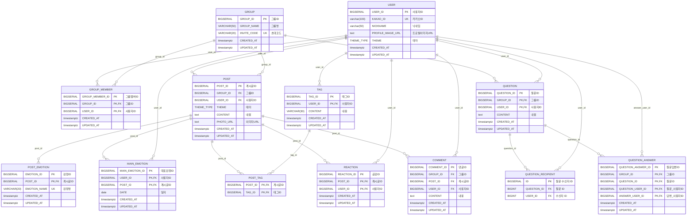

- **구성**: PostgreSQL 테이블 12개. 사용자, 그룹, 게시글을 중심으로 감정, 태그, 공감, 댓글, 질문이 붙습니다
- **기준**: erd-editor로 설계한 최종 ERD입니다. 관계선은 1:N으로 단순화했습니다

```mermaid
erDiagram
  USER {
    BIGSERIAL USER_ID PK "사용자ID"
    varchar(100) KAKAO_ID UK "카카오ID"
    varchar(50) NICKNAME "닉네임"
    text PROFILE_IMAGE_URL "프로필이미지URL"
    THEME_TYPE THEME "테마"
    timestamptz CREATED_AT
    timestamptz UPDATED_AT
  }
  GROUPS["GROUP"] {
    BIGSERIAL GROUP_ID PK "그룹ID"
    VARCHAR(50) GROUP_NAME "그룹명"
    VARCHAR(20) INVITE_CODE UK "초대코드"
    timestamptz CREATED_AT
    timestamptz UPDATED_AT
  }
  GROUP_MEMBER {
    BIGSERIAL GROUP_MEMBER_ID PK "그룹멤버ID"
    BIGSERIAL GROUP_ID PK,FK "그룹ID"
    BIGSERIAL USER_ID PK,FK "사용자ID"
    timestamptz CREATED_AT
    timestamptz UPDATED_AT
  }
  POST {
    BIGSERIAL POST_ID PK "게시글ID"
    BIGSERIAL GROUP_ID FK "그룹ID"
    BIGSERIAL USER_ID FK "사용자ID"
    THEME_TYPE THEME "테마"
    text CONTENT "내용"
    text PHOTO_URL "이미지URL"
    timestamptz CREATED_AT
    timestamptz UPDATED_AT
  }
  POST_EMOTION {
    BIGSERIAL EMOTION_ID PK "감정ID"
    BIGSERIAL POST_ID PK,FK "게시글ID"
    VARCHAR(20) EMOTION_NAME UK "감정명"
    timestamptz CREATED_AT
    timestamptz UPDATED_AT
  }
  MAIN_EMOTION {
    BIGSERIAL MAIN_EMOTION_ID PK "대표감정ID"
    BIGSERIAL USER_ID PK,FK "사용자ID"
    BIGSERIAL POST_ID PK,FK "게시글ID"
    date DATE "일자"
    timestamptz CREATED_AT
    timestamptz UPDATED_AT
  }
  TAG {
    BIGSERIAL TAG_ID PK "태그ID"
    BIGSERIAL USER_ID PK,FK "사용자ID"
    VARCHAR(30) CONTENT "내용"
    timestamptz CREATED_AT
    timestamptz UPDATED_AT
  }
  POST_TAG {
    BIGSERIAL POST_ID PK,FK "게시글ID"
    BIGSERIAL TAG_ID PK,FK "태그ID"
  }
  REACTION {
    BIGSERIAL REACTION_ID PK "공감ID"
    BIGSERIAL POST_ID PK,FK "게시글ID"
    BIGSERIAL USER_ID PK,FK "사용자ID"
    timestamptz CREATED_AT
    timestamptz UPDATED_AT
  }
  COMMENT {
    BIGSERIAL COMMENT_ID PK "댓글ID"
    BIGSERIAL GROUP_ID FK "그룹ID"
    BIGSERIAL POST_ID FK "게시글ID"
    BIGSERIAL USER_ID FK "사용자ID"
    text CONTENT "내용"
    timestamptz CREATED_AT
    timestamptz UPDATED_AT
  }
  QUESTION {
    BIGSERIAL QUESTION_ID PK "질문ID"
    BIGSERIAL GROUP_ID PK,FK "그룹ID"
    BIGSERIAL USER_ID PK,FK "사용자ID"
    text CONTENT "내용"
    timestamptz CREATED_AT
    timestamptz UPDATED_AT
  }
  QUESTION_RECIPIENT {
    BIGSERIAL ID PK "질문 수신자 ID"
    BIGINT QUESTION_ID FK "질문 ID"
    BIGINT USER_ID FK "수신자 ID"
  }
  QUESTION_ANSWER {
    BIGSERIAL QUESTION_ANSWER_ID PK "질문답변ID"
    BIGSERIAL GROUP_ID PK,FK "그룹ID"
    BIGSERIAL QUESTION_ID PK,FK "질문ID"
    BIGSERIAL QUESTION_USER_ID PK,FK "질문_사용자ID"
    BIGSERIAL ANSWER_USER_ID PK,FK "답변_사용자ID"
    timestamptz CREATED_AT
    timestamptz UPDATED_AT
  }
  USER ||--o{ GROUP_MEMBER : "user_id"
  GROUPS ||--o{ GROUP_MEMBER : "group_id"
  USER ||--o{ POST : "user_id"
  GROUPS ||--o{ POST : "group_id"
  POST ||--o{ POST_EMOTION : "post_id"
  POST ||--o{ MAIN_EMOTION : "post_id"
  USER ||--o{ MAIN_EMOTION : "user_id"
  USER ||--o{ TAG : "user_id"
  POST ||--o{ POST_TAG : "post_id"
  TAG ||--o{ POST_TAG : "tag_id"
  POST ||--o{ REACTION : "post_id"
  USER ||--o{ REACTION : "user_id"
  POST ||--o{ COMMENT : "post_id"
  USER ||--o{ COMMENT : "user_id"
  GROUPS ||--o{ QUESTION : "group_id"
  USER ||--o{ QUESTION : "user_id"
  QUESTION ||--o{ QUESTION_RECIPIENT : "question_id"
  USER ||--o{ QUESTION_RECIPIENT : "user_id"
  QUESTION ||--o{ QUESTION_ANSWER : "question_id"
  USER ||--o{ QUESTION_ANSWER : "answer_user_id"
```
